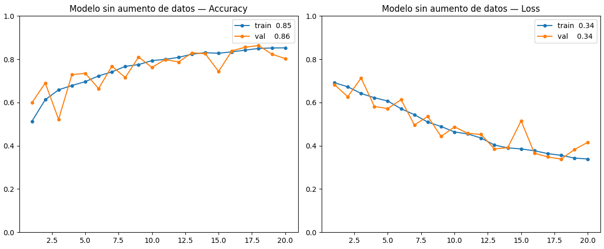
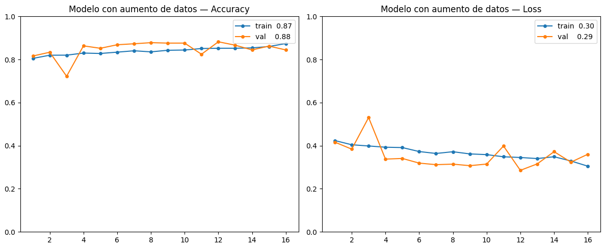
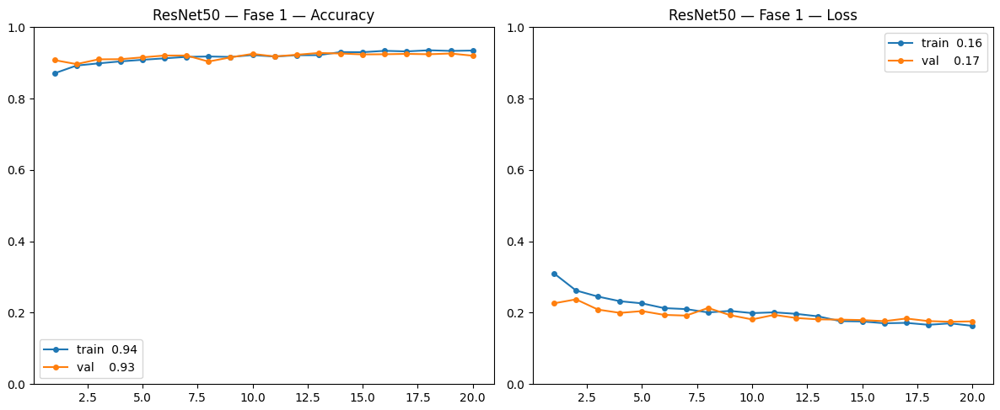
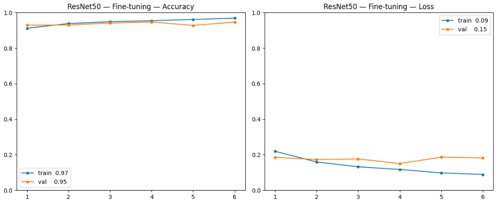
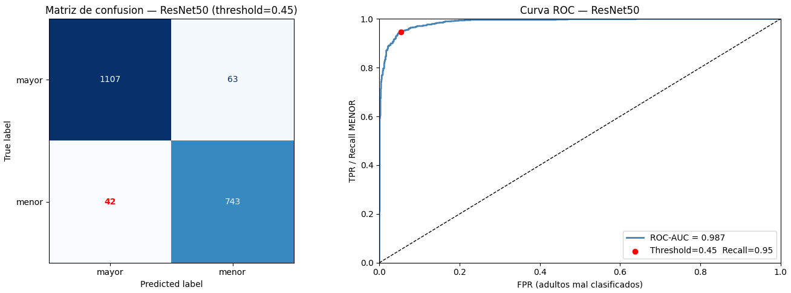
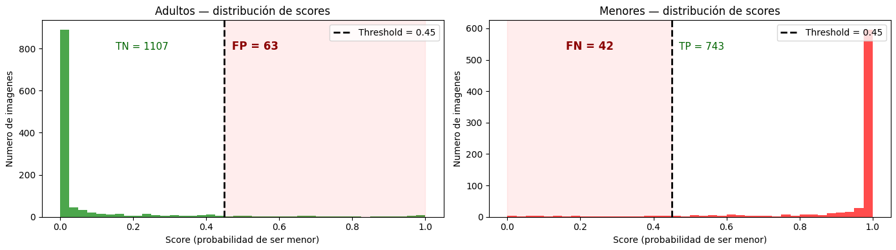

# Sistema de Detección y Pixelado de Rostros de Menores

Sistema distribuido orientado a eventos para detectar rostros en imágenes, clasificar si corresponden a menores de edad mediante una red neuronal convolucional, y pixelar automáticamente las caras de menores.

---

## Índice

1. [Requisitos previos](#requisitos-previos)
2. [Instalación en una máquina nueva](#instalación-en-una-máquina-nueva)
3. [Uso](#uso)
4. [Tests unitarios](#tests-unitarios)
5. [Estructura del proyecto](#estructura-del-proyecto)
6. [Almacenamiento con MinIO](#almacenamiento-con-minio)
7. [Descripción de cada servicio](#descripción-de-cada-servicio)
8. [Topics y flujo de eventos](#topics-y-flujo-de-eventos)
9. [Documentación funcional](#documentación-funcional)
10. [Gestión de errores](#gestión-de-errores)
11. [Decisiones de diseño](#decisiones-de-diseño)
12. [Entrenamiento del modelo de clasificación de edad](#entrenamiento-del-modelo-de-clasificación-de-edad)
13. [Solución de problemas frecuentes](#solución-de-problemas-frecuentes)

---

## Requisitos previos

- **Docker Desktop 4.x** con el backend WSL2 activado (Windows) o Docker Engine (Linux/Mac)
- **Git** con la extensión **Git LFS** instalada
- Los puertos `3000`, `8000`, `8001`, `9000`, `9092` y `5432` libres en la máquina host

### Recursos mínimos recomendados

El sistema corre varios modelos de visión por computadora en CPU. Con menos de estos recursos los contenedores pueden morir por OOM o tardar en exceso:

| Recurso | Mínimo |
|---|---|
| RAM asignada a Docker / WSL2 | 6 GB |
| CPU | 4 núcleos |
| Espacio en disco | 10 GB libres |

En Windows, la RAM que Docker puede usar se configura en **Docker Desktop → Settings → Resources → Memory**. Si usas WSL2 también puedes crear `%USERPROFILE%\.wslconfig` con:
```ini
[wsl2]
memory=6GB
```

---

## Instalación en una máquina nueva

Pasos en el orden exacto — saltarse el paso 1 hace que el modelo no se descargue al clonar.

### Paso 1 — Instalar Git LFS (antes de clonar)

```bash
git lfs install
```

Verifica que funciona:
```bash
git lfs version   # debe imprimir algo como "git-lfs/3.x.x"
```

### Paso 2 — Clonar el repositorio

```bash
git clone https://github.com/Alejandro428/proyecto-rostros.git
cd proyecto-rostros
```

Git LFS descarga automáticamente el modelo de clasificación de edad (~95 MB). Si ves un fichero `modelo_menores.h5` de solo unos pocos KB, es un puntero LFS — ejecuta `git lfs pull` para obtener el binario real.

### Paso 3 — Crear el archivo `.env`

Copia el bloque siguiente tal cual en un fichero llamado `.env` en la raíz del proyecto. Los valores funcionan para desarrollo local sin ningún cambio:

```env
KAFKA_SERVER=kafka:9092

MINIO_ENDPOINT=http://minio:9000
MINIO_USER=minioadmin
MINIO_PASSWORD=minioadmin

DB_HOST=db
DB_NAME=db_rostros
DB_USER=postgres
DB_PASSWORD=postgres

MAX_FILE_SIZE=10485760
PYTHONUNBUFFERED=1
```

`MINIO_ENDPOINT` es la URL interna que usan los servicios dentro de Docker para comunicarse con MinIO. No se necesita ninguna URL pública adicional — las presigned URLs se generan automáticamente usando el host del request entrante (ver sección de decisiones de diseño).

Todos los servicios validan al arranque que estas variables estén presentes. Si falta alguna, el contenedor termina inmediatamente con un mensaje de error claro en lugar de fallar con un error críptico de conexión.

### Paso 4 — Construir y arrancar

```bash
docker compose up -d --build
```

**El primer arranque tarda entre 10 y 20 minutos** porque Docker tiene que:
- Descargar las imágenes base de Python, Kafka y PostgreSQL
- Instalar las dependencias Python de cada servicio (insightface, tensorflow, etc.)
- Descargar el modelo de detección `buffalo_l` de insightface (~200 MB, solo en detection-service, la primera vez que arranca)

Los arranques siguientes son inmediatos si no hay cambios en el código.

### Paso 5 — Verificar

```bash
docker compose ps
```

Estado esperado:

| Contenedor | Estado |
|---|---|
| postgres | running |
| minio | running |
| kafka | running |
| kafka-init | exited (0) |
| api-1 | running |
| api-2 | running |
| detection-service | running |
| orchestrator-2 | running |
| age-service | running |
| orchestrator-3 | running |
| pixelation-service | running |
| frontend | running |
| frontend-builder | exited (0) |

`kafka-init` y `frontend-builder` con `exited (0)` es correcto: son contenedores de inicialización que terminan solos cuando su trabajo está hecho.

Abre [http://localhost:3000](http://localhost:3000) — si ves la interfaz, el sistema está listo.

---

## Uso

**Interfaz web:** abre [http://localhost:3000](http://localhost:3000) en el navegador.

También puedes usar la API directamente. Formatos aceptados: `JPEG`, `PNG` — máximo **10 MB**.

**Subir una imagen:**
```bash
curl -X POST http://localhost:8000/upload \
  -F "file=@/ruta/a/imagen.jpg"
```

La respuesta incluye el `GUID_Solicitud`:
```json
{"GUID_Solicitud": "abc-123", "Id_Imagen": 1, "status": "CREADA"}
```

**Consultar el resultado** (esperar unos segundos):
```bash
curl http://localhost:8001/resultado/abc-123
```

**Consultar una cara concreta:**
```bash
curl http://localhost:8001/resultado/abc-123/cara/2
```

**Listar solicitudes:**
```bash
curl http://localhost:8001/solicitudes?limite=20
```

**Detener el sistema:**
```bash
docker compose down
```

Para eliminar también los volúmenes (BD, MinIO, Kafka):
```bash
docker compose down -v
```

**Re-entrenar el modelo (opcional):**
```bash
bash scripts/train.sh
```

El script entrena el modelo, lo copia a `age-service` y reinicia el contenedor automáticamente.

---

## Tests unitarios

La suite cubre la lógica de negocio crítica de cada servicio sin necesitar infraestructura real (Kafka, PostgreSQL, MinIO ni modelos ML). Los tests son completamente autónomos: replican la lógica que testean en lugar de importar los módulos de servicio, evitando así dependencias de arranque como conexiones a base de datos o carga de modelos.

### Instalación de dependencias

```bash
pip install -r tests/requirements.txt
```

Los tests de procesamiento de imagen (`test_pixelation.py`) requieren además:

```bash
pip install opencv-python-headless numpy
```

Si `opencv-python-headless` no está instalado, ese fichero se salta automáticamente sin fallar el resto de la suite.

### Ejecutar los tests

Todos los tests:
```bash
pytest tests/ -v
```

Un fichero concreto:
```bash
pytest tests/test_api1.py -v
```

Una clase concreta:
```bash
pytest tests/test_pixelation.py::TestGenerarImagenTerminada -v
```

### Qué verifica cada fichero

| Fichero | Servicio | Qué comprueba | Tests |
|---|---|---|---|
| `test_api1.py` | api-1 | **Magic bytes**: identifica JPEG/PNG por contenido real, no por extensión — detecta GIF, WebP, PDF y texto como inválidos. **Extensión**: normaliza mayúsculas, rechaza formatos no permitidos. **Tamaño**: límite exacto de 10 MB, límite incluido y límite + 1 byte. | 26 |
| `test_api2.py` | api-2 | **Presigned URL**: `key=None` o `key=""` devuelve `None`; el endpoint interno `minio:9000` es sustituido por la URL pública; la firma SigV4 (query string completo) se preserva intacta; excepciones boto3 devuelven `None`. **Host público**: `X-Forwarded-Host` tiene prioridad sobre `Host`; el puerto se preserva (`$http_host` vs `$host`); esquema https con `X-Forwarded-Proto`; fallback a `localhost:3000`. | 15 |
| `test_age.py` | age-service | **Umbral 0.45**: exactamente en el umbral es MENOR, un dígito por debajo es ADULTO. El umbral conservador clasifica 0.46 como menor (con 0.50 sería adulto). **Relación `es_menor`/`Mayor_18`**: son siempre opuestos para todos los valores de score posibles. | 15 |
| `test_orchestrators.py` | orchestrator-2 y orchestrator-3 | **Orch-2**: con caras → `cmd.age_detection`; sin caras → `cmd.storage`. **Orch-3**: con algún menor → `cmd.pixelation`; todos adultos o sin caras → `cmd.storage`; campo `es_menor` ausente se trata como adulto. | 10 |
| `test_pixelation.py` | pixelation-service | **`generar_imagen_terminada`**: la región de un menor queda pixelada (valor de píxeles cambia); la región de un adulto queda intacta; con lista vacía la imagen es idéntica; la imagen original no se modifica (se trabaja sobre copia); en una imagen mixta solo se pixela el menor; `roi.size=0` no lanza excepción. **`generar_imagen_marcos`**: las dimensiones son idénticas al original; lista vacía produce una copia exacta; la imagen original no se modifica. | 14 |

### Resultado esperado

```
84 passed in ~0.4s
```

---

## Estructura del proyecto

```
proyecto_rostros/
├── docker-compose.yml
├── .env
├── scripts/
│   ├── train.sh              # Entrenamiento local con GPU
│   └── deploy_model.sh       # Despliegue de un modelo externo (.h5)
├── training/
│   ├── Dockerfile
│   ├── train_age.py          # Script de entrenamiento
│   └── red_neuronal_proyecto_imagenes.ipynb  # Notebook para Google Colab
├── infra/
│   └── postgres/
│       └── init.sql          # Schema de la base de datos
├── contracts/
│   ├── comandos/             # Schemas JSON de comandos Kafka
│   └── eventos/              # Schemas JSON de eventos Kafka
└── services/
    ├── api-1/                # Ingesta de imágenes (fusiona Orquestador-1)
    ├── detection-service/    # Detección de rostros con RetinaFace
    ├── orchestrator-2/       # Orquestación post-detección
    ├── age-service/          # Clasificación de edad con red neuronal
    ├── orchestrator-3/       # Orquestación post-clasificación
    ├── pixelation-service/   # Pixelado y generación de imágenes (fusiona Orquestador-4)
    ├── api-2/                # Consulta de resultados
    └── frontend/             # Interfaz web (React + Vite, servida por Nginx)
```

---

## Almacenamiento con MinIO

MinIO es un servidor de almacenamiento de objetos compatible con la API de Amazon S3. En este proyecto actúa como sistema de ficheros compartido entre todos los servicios — ningún servicio guarda imágenes en disco local; todo sube y baja de MinIO.

### Interfaces de acceso

| Interfaz | URL | Uso |
|---|---|---|
| API S3 (programática) | `http://minio:9000` (interno Docker) | Los servicios Python usan la librería `boto3` contra este endpoint |
| Consola web de administración | [http://localhost:9001](http://localhost:9001) | Permite explorar buckets y objetos visualmente. Credenciales: `minioadmin` / `minioadmin` |

### Buckets

El sistema usa dos buckets que se crean automáticamente al arrancar los servicios:

| Bucket | Contenido |
|---|---|
| `images-raw` | Imagen original subida por el usuario + crops de caras individuales |
| `images-processed` | Imágenes de salida generadas por el pipeline (marcos y pixelada) |

### Estructura de claves (rutas de objetos)

Todos los objetos de una misma solicitud comparten el prefijo `{guid}`, donde `{guid}` es el UUID único de esa solicitud:

| Objeto | Bucket | Clave | Lo sube |
|---|---|---|---|
| Imagen original | `images-raw` | `{guid}/{uuid}.{ext}` | API-1 al recibir el upload |
| Crop de cada cara | `images-raw` | `{guid}/faces/{id_cara}.jpg` | Orchestrator-2 tras la detección |
| Imagen con marcos | `images-processed` | `{guid}/marcos.jpg` | Pixelation Service |
| Imagen terminada (menores pixelados) | `images-processed` | `{guid}/terminada.jpg` | Pixelation Service (solo si hay menores) |

Las claves son deterministas: si un servicio falla y el mensaje se reprocesa, las subidas sobreescriben los objetos anteriores sin efectos secundarios.

### Qué servicio interactúa con MinIO y cómo

```
API-1          → crea bucket images-raw si no existe
               → sube imagen original            → images-raw/{guid}/{uuid}.jpg

Detection      → descarga imagen original        ← images-raw

Orchestrator-2 → descarga imagen original        ← images-raw
               → sube crop por cada cara         → images-raw/{guid}/faces/{id}.jpg

Age Service    → descarga crop de cada cara      ← images-raw

Pixelation     → crea bucket images-processed si no existe
               → descarga imagen original        ← images-raw
               → sube marcos.jpg                 → images-processed/{guid}/marcos.jpg
               → sube terminada.jpg              → images-processed/{guid}/terminada.jpg

API-2          → genera presigned URLs           ← ambos buckets (lectura)
```

### Cómo se sirven las imágenes al navegador

El navegador nunca contacta directamente con MinIO (que no está expuesto públicamente). API-2 genera **presigned URLs**: URLs temporales firmadas con las credenciales del servidor, válidas durante 1 hora, que incluyen la firma SigV4 en la query string. Estas URLs apuntan a la ruta `/storage/` de Nginx, que las reenvía internamente a MinIO. El mecanismo completo se describe en [Presigned URLs a través del proxy Nginx](#presigned-urls-a-través-del-proxy-nginx).

---

## Descripción de cada servicio

### Frontend (puerto 3000)

Interfaz web construida con React + Vite y servida por Nginx. Construida mediante un servicio `frontend-builder` en Docker Compose — este patrón es necesario porque `docker build` en WSL2 falla al descargar paquetes npm por limitaciones de MTU de red; ejecutar el build como un contenedor independiente evita ese problema.

**Funcionalidades:**
- Subida de imagen por arrastrar y soltar o selector de fichero, con vista previa antes de enviar
- Validación de formato por magic bytes (contenido real del fichero, no solo extensión)
- Pantalla de procesamiento con polling automático hasta obtener resultado
- Notificación automática (toast) al completarse el análisis
- Visualización de resultado: tres pestañas — imagen pixelada, con marcos de detección y original
- Galería de caras individuales con clasificación (MENOR/ADULTO), score y borde de color
- Estadísticas globales en la cabecera: total de imágenes procesadas, caras detectadas y menores
- Historial con miniaturas, filtros por estado (Completadas / En proceso / Error) y búsqueda por ID con autocompletado
- Modo oscuro con persistencia en localStorage
- Timestamps en zona horaria Europe/Madrid

---

### API-1 — Ingesta (puerto 8000)

Punto de entrada del sistema. Fusiona el rol de Orquestador-1.

**Responsabilidades:**
- Valida el fichero recibido por magic bytes y tamaño máximo
- Sube la imagen original al bucket `images-raw` de MinIO
- Registra la solicitud en PostgreSQL con estado `CREADA`
- Publica `images.raw` y `cmd.face_detection` en Kafka
- Devuelve el `GUID_Solicitud` al cliente

**Endpoints:**
- `POST /upload` — sube una imagen e inicia el pipeline. Formatos aceptados: `jpg`, `jpeg`, `png`. Tamaño máximo: 10 MB.
- `GET /health` — comprobación de salud

**Orden de operaciones:** MinIO → PostgreSQL → Kafka. Este orden es deliberado: si MinIO falla no se crea registro en BD; si Kafka falla se hace rollback del registro en BD. Así nunca queda una solicitud registrada que el sistema no pueda procesar.

---

### Detection Service — Detección de rostros

Detecta los rostros presentes en la imagen mediante RetinaFace (insightface).

**Responsabilidades:**
- Consume `cmd.face_detection`
- Descarga la imagen de MinIO
- Ejecuta la detección con el modelo `buffalo_l` de insightface
- Publica `evt.face_detection.completed` con la lista de bounding boxes
- Registra en BD el timestamp de fin de detección

**Configuración:** `model=buffalo_l`, `det_size=(640, 640)`, CPU inference

---

### Orchestrator-2 — Orquestación post-detección

Procesa el resultado de la detección y prepara las caras para la clasificación de edad.

**Responsabilidades:**
- Consume `evt.face_detection.completed`
- Descarga la imagen original de MinIO
- Para cada cara detectada: recorta el crop, lo sube a MinIO en `{guid}/faces/{id}.jpg` e inserta una fila en la tabla `Imagenes`
- **Si hay caras:** actualiza el estado a `CARAS_DETECTADAS` y publica `cmd.age_detection`
- **Si no hay caras:** actualiza el estado a `CARAS_DETECTADAS` y publica `cmd.storage` para cerrar el flujo directamente

---

### Age Service — Clasificación de edad

Clasifica si cada cara corresponde a un menor mediante una CNN entrenada.

**Responsabilidades:**
- Consume `cmd.age_detection`
- Descarga cada crop de MinIO
- Aplica el modelo `modelo_menores.h5` con umbral `score >= 0.45 → MENOR`
- Actualiza `Mayor_18` y `Escore` en BD por cada cara
- Actualiza el estado a `EDAD_CALCULADA`
- Publica `evt.age_detection.completed` con `score` y `es_menor` por cara

**Modelo: ResNet50 con transfer learning y augmentación**

El modelo final es una ResNet50 pre-entrenada en ImageNet, ajustada sobre el dataset [face_age (Kaggle)](https://www.kaggle.com/datasets/frabbisw/facial-age). Entrada `256×320×3`, salida sigmoid `[0,1]`. Distribuido vía Git LFS (~95 MB).

**Por qué transfer learning (ResNet50)**

Se evaluó primero una CNN entrenada desde cero. Aunque alcanzó ~84 % de recall (FN ≈ 124 menores no detectados), el aprendizaje era lento y limitado por el tamaño del dataset. ResNet50 ya tiene en sus capas convolucionales patrones de bajo y alto nivel (bordes, texturas, formas faciales) aprendidos sobre millones de imágenes — exactamente lo que necesita la clasificación de edad. Reutilizar esos pesos reduce drásticamente el número de parámetros a entrenar, acelera la convergencia y permite obtener resultados de mayor calidad con el mismo dataset. El modelo resultante alcanza 0.95 de recall (FN = 42), reduciendo a menos de la mitad los menores no detectados respecto a la CNN base.

**Por qué augmentación de datos**

El dataset tiene desbalance de clases y variabilidad limitada en condiciones de captura (iluminación, ángulos). Aplicar flip horizontal, rotación (±15 %), zoom (±15 %), variación de brillo y contraste en cada batch de entrenamiento genera variantes sintéticas que hacen el modelo más robusto frente a imágenes tomadas en condiciones reales. El class weighting complementa esto compensando el desbalance entre clases durante la optimización.

**Entrenamiento — base congelada (20 épocas, LR = 0.001)**

Solo se entrena la cabeza densa (`GAP → Dense(64) → Dropout → Dense(32) → sigmoid`). La base ResNet50 permanece congelada, preservando los pesos de ImageNet. El fine-tuning se evaluó pero se descartó por fragilidad en el entrenamiento y mejora marginal — ver sección [Entrenamiento del modelo](#entrenamiento-del-modelo-de-clasificación-de-edad).

**Control del sobreajuste**

Los callbacks están separados por responsabilidad:
- `EarlyStopping(val_loss, patience=5)` — para el entrenamiento cuando la pérdida de validación empieza a subir, señal temprana de sobreajuste.
- `ModelCheckpoint(val_loss)` — guarda el checkpoint con menor pérdida de validación, la señal más fiable de generalización. El recall se evalúa después sobre ese modelo.
- `ReduceLROnPlateau(val_loss)` — reduce el LR si la pérdida se estanca.

El recall es la métrica de referencia porque el coste de un falso negativo (menor no detectado) es mucho mayor que el de un falso positivo. El umbral de 0.45 (en lugar de 0.50) refuerza esta prioridad.

---

### Orchestrator-3 — Orquestación post-clasificación

Evalúa si existen menores y decide si es necesario pixelar.

**Responsabilidades:**
- Consume `evt.age_detection.completed`
- **Si hay menores:** registra el inicio del pixelado en BD y publica `cmd.pixelation`
- **Si no hay menores:** publica `cmd.storage` (no se pixela nada)

---

### Pixelation Service — Pixelado y cierre (fusiona Orquestador-4)

Genera las imágenes de salida y cierra el flujo. Fusiona el rol de Orquestador-4.

**Responsabilidades:**
- Consume `cmd.pixelation` y `cmd.storage`

**Caso `cmd.pixelation` (hay menores):**
- Genera imagen con marcos: rectángulo rojo (MENOR) o verde (ADULTO) con score
- Genera imagen terminada: caras de menores pixeladas (reducción a 12×12 y escalado)
- Sube ambas imágenes a `images-processed`
- Cierra la solicitud con `Estado = COMPLETADA`

**Caso `cmd.storage` con caras (no hay menores):**
- Genera solo la imagen con marcos (todos marcados como ADULTO en verde)
- Cierra la solicitud con `Estado = COMPLETADA`

**Caso `cmd.storage` sin caras:**
- Cierra la solicitud con `Estado = COMPLETADA` sin generar imágenes adicionales

En todos los casos publica `evt.pixelation.completed`.

---

### API-2 — Consulta de resultados (puerto 8001)

Sirve los resultados procesados mediante presigned URLs de MinIO, válidas 1 hora (ver [Presigned URLs a través del proxy Nginx](#presigned-urls-a-través-del-proxy-nginx) y [Almacenamiento con MinIO](#almacenamiento-con-minio)).

**Endpoints:**
- `GET /resultado/{guid}` — solicitud completa: estado, tiempos de inicio y fin de cada fase (detección, edad, pixelado) en UTC, imagen original, imagen con marcos, imagen terminada, y lista de caras con su clasificación y bounding box
- `GET /resultado/{guid}/thumbnail` — presigned URL de la imagen original (ligero, para previsualizaciones)
- `GET /resultado/{guid}/cara/{id_cara}` — cara individual: crop de la cara, `es_menor`, `score` y bounding box
- `GET /solicitudes?limite=N` — listado de solicitudes con miniaturas, ordenadas por fecha descendente
- `GET /health` — comprobación de salud

---

## Topics y flujo de eventos

### Topics Kafka

| Topic | Tipo | Productor | Consumidor |
|---|---|---|---|
| `images.raw` | Evento | API-1 | — (auditoría) |
| `cmd.face_detection` | Comando | API-1 | Detection Service |
| `evt.face_detection.completed` | Evento | Detection Service | Orchestrator-2 |
| `cmd.age_detection` | Comando | Orchestrator-2 | Age Service |
| `evt.age_detection.completed` | Evento | Age Service | Orchestrator-3 |
| `cmd.pixelation` | Comando | Orchestrator-3 | Pixelation Service |
| `cmd.storage` | Comando | Orchestrator-2 / Orchestrator-3 | Pixelation Service |
| `evt.pixelation.completed` | Evento | Pixelation Service | — (cierre de flujo) |

---

## Documentación funcional

### Diagrama de arquitectura

```
                        ┌─────────────┐
     Cliente ──────────►│    API-1    │
                        │  (8000)     │
                        └──────┬──────┘
                               │ cmd.face_detection
                               ▼
                     ┌──────────────────┐
                     │Detection Service │
                     │  (RetinaFace)    │
                     └────────┬─────────┘
                              │ evt.face_detection.completed
                              ▼
                     ┌──────────────────┐
                     │ Orchestrator-2   │──── sin caras ────► cmd.storage ──┐
                     │  (cropea caras)  │                                   │
                     └────────┬─────────┘                                   │
                              │ cmd.age_detection                           │
                              ▼                                             │
                     ┌──────────────────┐                                   │
                     │  Age Service     │                                   │
                     │  (ResNet50≥0.45) │                                   │
                     └────────┬─────────┘                                   │
                              │ evt.age_detection.completed                 │
                              ▼                                             │
                     ┌──────────────────┐                                   │
                     │ Orchestrator-3   │── sin menores ──► cmd.storage ────┤
                     │ (decide pixelar) │                                   │
                     └────────┬─────────┘                                   │
                              │ cmd.pixelation                              │
                              ▼                                             ▼
                     ┌────────────────────────────────────────────────────────┐
                     │               Pixelation Service                       │
                     │   marcos + terminada  /  solo marcos  /  sin imágenes  │
                     │                evt.pixelation.completed                │
                     └────────────────────────────────────────────────────────┘
                                          │ PostgreSQL + MinIO
                                          ▼
                        ┌─────────────┐
     Cliente ──────────►│    API-2    │
                        │  (8001)     │
                        └─────────────┘
```

### Infraestructura de soporte

| Componente | Uso |
|---|---|
| **Apache Kafka 4.2** | Bus de eventos entre servicios |
| **MinIO** | Almacenamiento de imágenes (S3-compatible) |
| **PostgreSQL 15** | Estado de solicitudes y clasificaciones |

### Estados del ciclo de vida de una solicitud

```
CREADA → CARAS_DETECTADAS → EDAD_CALCULADA → COMPLETADA
                                             ERROR (en cualquier punto si falla un servicio)
```

| Estado | Lo establece | Significado |
|---|---|---|
| `CREADA` | API-1 | Imagen recibida y encolada |
| `CARAS_DETECTADAS` | Orchestrator-2 | Detección terminada, crops subidos a MinIO |
| `EDAD_CALCULADA` | Age Service | Clasificación de edad completada |
| `COMPLETADA` | Pixelation Service | Imágenes de salida generadas, flujo cerrado |
| `ERROR` | Cualquier consumer | Fallo irrecuperable durante el procesamiento |

Los contratos completos de cada mensaje en formato JSON Schema están en el directorio `/contracts/`.

---

## Gestión de errores

### Qué ocurre si falla un servicio

| Escenario | Comportamiento |
|---|---|
| **Falla Detection Service** | El mensaje `cmd.face_detection` no se confirma en Kafka. Al reiniciar, lo relee y reintenta. |
| **Falla Age Service** | El mensaje `cmd.age_detection` no se confirma. Los crops siguen en MinIO. Al reiniciar, reclasifica desde el principio. |
| **Falla Orchestrator-3** | El mensaje `evt.age_detection.completed` no se confirma. Al reiniciar, repite la decisión menores/no menores. |
| **Falla Pixelation Service** | El mensaje `cmd.pixelation` o `cmd.storage` no se confirma. Al reiniciar, regenera las imágenes (la subida a MinIO es idempotente por clave fija). |
| **Falla MinIO** | La excepción es capturada en el loop. El offset Kafka no se confirma, el mensaje se reentrega al reiniciar. La solicitud se marca como `ERROR` en BD. |
| **Falla PostgreSQL** | Igual que MinIO: excepción capturada, offset no confirmado, solicitud marcada como `ERROR`. |

### Estrategias de manejo implementadas

**Commit manual del offset Kafka:**
Todos los consumers tienen desactivado el auto-commit (`enable.auto.commit=false`). Por defecto, Kafka confirma automáticamente los mensajes cada 5 segundos, independientemente de si el procesamiento terminó bien o no. Esto significa que si un servicio falla a mitad del trabajo, Kafka marca el mensaje como procesado y se pierde. Con el commit manual, el offset solo avanza cuando todo el procesamiento ha terminado con éxito.

**Entrega at-least-once:**
Como consecuencia del commit manual, si un servicio cae justo después de procesar pero antes de confirmar el offset, el mensaje se reentregará al reiniciar. Todos los servicios están diseñados para tolerar este escenario: las claves de MinIO son deterministas (se sobreescriben sin problema) y las actualizaciones de BD son idempotentes.

**Marcado de estado `ERROR`:**
Cuando un consumer captura una excepción irrecuperable, marca la solicitud como `ERROR` en BD y confirma el offset. Esto evita que el sistema quede en un bucle infinito reprocesando un mensaje que nunca podrá completarse (por ejemplo, una imagen corrupta). El estado `ERROR` es visible en el frontend y en la API de consulta.

**Graceful shutdown:**
Cada consumer registra handlers para las señales `SIGTERM` y `SIGINT`. Cuando Docker para un contenedor, envía primero `SIGTERM` (por favor para). Si el proceso lo ignora, Docker espera 10 segundos y envía `SIGKILL` (para ahora sí o sí), matando el proceso a la fuerza y posiblemente en medio de una operación. Con el handler implementado, la señal cambia un flag `running = False` que para el bucle al terminar la iteración actual, permitiendo cerrar la conexión con Kafka limpiamente.

**Aislamiento de errores por cara:**
En Age Service y Orchestrator-2, los errores en el procesamiento de una cara individual son capturados y logueados sin interrumpir el procesamiento de las demás caras del mismo mensaje.

**Idempotencia en MinIO:**
Las claves de las imágenes de salida son deterministas (`{guid}/marcos.jpg`, `{guid}/terminada.jpg`, `{guid}/faces/{id}.jpg`). Si se reprocesa una solicitud, las imágenes se sobreescriben sin efectos secundarios.

### Error al descargar imágenes Docker (Cloudflare R2 bloqueado)

**Síntoma:**
```
failed to copy: httpReadSeeker: failed open: failed to do request: Get
"https://docker-images-prod.*.r2.cloudflarestorage.com/...":
dial tcp 172.64.66.1:443: connectex: A connection attempt failed...
```

**Causa:** Docker Hub migró su CDN a Cloudflare R2. Algunos ISPs o routers bloquean el IP `172.64.66.1`, impidiendo la descarga de imágenes. El proyecto y su configuración son correctos; el problema es de red en la máquina local.

**Solución:** Configurar un mirror de registro en Docker Desktop.

1. Abre **Docker Desktop → Settings → Docker Engine**
2. Añade `"registry-mirrors"` al JSON:

```json
{
  "registry-mirrors": ["https://mirror.gcr.io"]
}
```

3. Haz clic en **Apply & restart**
4. Verifica con `docker pull hello-world`

El mirror de Google descarga las imágenes desde sus propios servidores, evitando el CDN de Cloudflare R2.

---

### Limitaciones conocidas

- **Sin dead-letter queue (DLQ):** Los mensajes sistemáticamente inprocesables se marcan como `ERROR` en BD y su offset se confirma, pero no se guardan en un topic de errores separado para análisis posterior.
- **Sin backoff exponencial:** Un fallo de BD o MinIO provoca reintento inmediato en el siguiente ciclo del loop, sin espera progresiva.
- **Consistencia eventual:** El estado en BD puede quedar parcialmente actualizado si un servicio falla a mitad del procesamiento de un mensaje con múltiples caras.

---

## Decisiones de diseño

### Validación por magic bytes

Los formatos de imagen se validan leyendo los primeros bytes del fichero, no la extensión. La extensión puede ser falsa (un fichero `.jpg` puede contener cualquier cosa), pero los primeros bytes de un fichero son su firma real: un JPEG siempre empieza por `FF D8 FF`, un PNG por `89 50 4E 47`, etc. Esta validación se realiza tanto en el backend (API-1) como en el frontend antes de enviar.

### Orden de operaciones en API-1: MinIO → BD → Kafka

El orden importa porque cada paso puede fallar:

- Si MinIO falla primero: no hay registro en BD, estado limpio.
- Si BD falla después de MinIO: hay un fichero huérfano en MinIO sin referencia, pero nada visible para el usuario.
- Si Kafka falla después de BD: se hace rollback del registro en BD. El fichero queda en MinIO sin referencia (limpieza manual si fuera necesario), pero el usuario recibe un error claro y puede reintentar.

El orden inverso (BD → MinIO → Kafka, que era el original) dejaba registros en BD apuntando a ficheros que no existían si MinIO fallaba.

### Orden de operaciones en consumers: Kafka → BD

En todos los servicios que consumen y producen eventos, la publicación en Kafka se hace antes de actualizar la BD. El motivo es que Kafka es el mecanismo de progreso del sistema: si el downstream no recibe el evento, el flujo se detiene independientemente de lo que diga la BD. Si la BD falla después de publicar en Kafka, el siguiente servicio ya tiene el mensaje y el sistema sigue avanzando; la actualización de la BD es solo una métrica de tiempo que puede perderse sin consecuencias graves.

### Umbral 0.45 en lugar de 0.50 para clasificación de menores

El modelo devuelve un score entre 0 y 1 donde 1 = menor. El umbral estándar sería 0.50, pero se usa 0.45 para ser más conservadores: es preferible pixelar algún adulto por error (falso positivo) que dejar sin pixelar a un menor (falso negativo). La diferencia en falsos positivos a este umbral es mínima según las métricas de validación del modelo.

### Presigned URLs a través del proxy Nginx

Las imágenes no se sirven pasando por API-2. En cambio, API-2 genera URLs firmadas temporalmente que el navegador usa para descargar el fichero. El flujo completo es:

1. Nginx reenvía las peticiones a API-2 incluyendo el header `X-Forwarded-Host` con el valor exacto del `Host` del cliente (p.ej. `localhost:3000`), preservando el puerto.
2. API-2 firma la URL usando el endpoint **interno** (`minio:9000`), pero reemplaza ese host por `{scheme}://{X-Forwarded-Host}/storage`.
3. El navegador hace GET a, por ejemplo, `http://localhost:3000/storage/images-raw/guid/foto.jpg?X-Amz-Signature=...`
4. Nginx recibe la petición en `location /storage/` y la reenvía a `http://minio:9000/`, forzando el header `Host: minio:9000` — el mismo host que se usó al firmar.
5. MinIO verifica la firma y devuelve el fichero.

La ventaja de este diseño es que **no requiere ninguna variable de configuración adicional**: el host de la URL se deriva automáticamente del header `X-Forwarded-Host` del request entrante, por lo que el mismo código funciona en local (`localhost:3000`), en una red local (`192.168.1.X:3000`) o en producción (`https://midominio.com`), sin tocar el `.env`.

---

## Entrenamiento del modelo de clasificación de edad

Aquí se recorre el camino que llevó a elegir ResNet50 sin fine-tuning como arquitectura final, con las gráficas de cada experimento para que se pueda ver en qué punto del proceso cada decisión tenía sentido.

### Experimento 1 — CNN entrenada desde cero

El punto de partida fue una CNN propia de tres bloques convolucionales entrenada directamente sobre el dataset [face_age (Kaggle)](https://www.kaggle.com/datasets/frabbisw/facial-age), sin ningún conocimiento previo. El entrenamiento arrancó de forma bastante inestable y la pérdida de validación estuvo oscilando durante buena parte de las 20 épocas.



El problema de fondo es que una CNN desde cero tiene que aprender todo: desde detectar bordes hasta entender geometría facial. Con el tamaño de dataset que teníamos, eso es mucho pedir, y los resultados lo reflejan (accuracy val 0.86, pérdida todavía alta al final).

### Experimento 2 — CNN con aumento de datos

El siguiente paso fue añadir aumento de datos: flip horizontal, rotación y zoom en cada batch. Esto generó variantes sintéticas que hicieron el entrenamiento más estable y bajaron la pérdida final (val 0.29 frente a 0.34).



La mejora es real, pero el techo de la arquitectura queda a la vista. Por muchas variantes que generemos, si la red no tiene una base sólida de la que partir, sus representaciones faciales van a seguir siendo limitadas.

### Por qué ResNet50 — Fase 1 (base congelada)

ResNet50 lleva pre-entrenada en ImageNet, lo que significa que sus capas ya saben reconocer bordes, texturas y formas en general. En la Fase 1 se congela toda esa base y solo se entrena la cabeza de clasificación que se añade encima (`GAP → Dense(64) → Dropout → Dense(32) → sigmoid`). El razonamiento es sencillo: dejar que la cabeza aprenda a usar lo que ResNet ya sabe antes de tocar nada más.



El cambio es inmediato. Desde la primera época el modelo arranca en accuracy val 0.91 y cierra las 20 épocas en val 0.93 con pérdida val 0.17. Lo más llamativo es que las curvas de train y val van prácticamente pegadas durante todo el entrenamiento: no hay sobreajuste, el modelo generaliza bien y tiene margen para seguir mejorando.

### Por qué quedarse con la época 2 del fine-tuning

Una vez que la cabeza está bien ajustada, el fine-tuning desbloquea las últimas 30 de las 175 capas de ResNet50 con un learning rate 10× menor (0.0001). La idea es afinar las capas más profundas para que se adapten a caras de personas en lugar de quedarse en las representaciones genéricas de ImageNet, pero haciéndolo despacio para no destruir lo que ya funciona.



La gráfica de pérdida cuenta exactamente lo que pasó:

- **Época 1:** train 0.21 / val 0.19 — el modelo parte del estado que dejó la Fase 1.
- **Época 2:** train 0.16 / val 0.16 — ambas pérdidas en su punto más bajo y prácticamente iguales. Aquí el fine-tuning ha hecho su trabajo sin pasarse.
- **Época 3 en adelante:** la pérdida de entrenamiento sigue cayendo (0.13, 0.11…) pero la de validación empieza a subir (0.19…). Es la señal clásica de sobreajuste: el modelo empieza a memorizar los datos de entrenamiento y pierde capacidad de generalizar a imágenes nuevas.

La época 6 tiene train accuracy 0.97 pero val 0.95 y la pérdida de validación sigue por encima de la de época 2. Entrenar más no ayuda, solo empeora las cosas. Por eso se guardó el modelo de la época 2.

### Resultado final y por qué nos importa el recall

Las métricas, la matriz de confusión y la distribución de scores que se muestran a continuación corresponden al modelo de ResNet50 con la base congelada (Fase 1, sin fine-tuning), que es el que se usa en producción.

Con umbral 0.45:



- **Recall sobre menores: 0.95** — solo 42 de 785 menores no son detectados (FN).
- **Precisión sobre menores: 0.92** — 63 adultos son marcados incorrectamente (FP).
- **ROC-AUC: 0.987** — el modelo separa las clases con mucha claridad en todo el rango de umbrales.



La mayoría de adultos puntúa cerca de 0 y la mayoría de menores cerca de 1, con muy pocos casos en la zona ambigua del umbral. Los errores que comete el modelo corresponden en su mayoría a personas en la franja de los 17-18 años, donde la distinción es genuinamente difícil.

**¿Por qué no usar el fine-tuning si es algo mejor?**

El fine-tuning mejora ligeramente el recall (alrededor de medio punto porcentual), pero tiene un coste que no compensa ese margen. Como se ve en la gráfica de entrenamiento, el modelo empieza a sobreajustarse desde la tercera época: la pérdida de entrenamiento sigue bajando mientras la de validación sube, y la ventana en la que el modelo está en su punto óptimo es muy estrecha. Para capturar ese momento hay que parar el entrenamiento en la época exacta mediante lógica personalizada, lo que hace el proceso de entrenamiento más frágil y menos reproducible. Si en un re-entrenamiento futuro ese punto óptimo cae en una época diferente, el resultado puede ser peor que el de la Fase 1.

La Fase 1, en cambio, entrena de forma estable durante 20 épocas con las curvas de train y val prácticamente pegadas, y ya alcanza un recall de 0.95 y un ROC-AUC de 0.987. Añadir fine-tuning para ganar medio punto de recall a cambio de fragilidad en el entrenamiento no es una buena apuesta, especialmente cuando los resultados ya son sólidos.

**Por qué el recall es la métrica que más importa aquí**

En este sistema la prevalencia de menores en las imágenes del mundo real es desconocida y variable, lo que hace que métricas como la accuracy sean poco fiables para evaluar el rendimiento real: si en una imagen hay pocas caras de menores, un modelo que simplemente clasifique todo como adulto tendría una accuracy alta pero sería completamente inútil. Por eso se utilizan métricas independientes de la prevalencia como el recall, la precisión y el ROC-AUC, que miden el comportamiento del modelo por clase sin verse afectadas por cuántos casos de cada tipo haya en el conjunto de datos.

Entre todas ellas, el recall sobre menores es la que más peso tiene en las decisiones de diseño. El objetivo del sistema es que ningún menor quede sin pixelar, lo que convierte cada falso negativo (un menor que el modelo no detecta) en el error más costoso posible. Un falso positivo —pixelar a un adulto— es un error menor y asumible. Por eso el umbral de decisión se fijó en 0.45 en lugar del 0.50 estándar, inclinando deliberadamente la balanza hacia detectar más menores aunque eso suponga pixelar algún adulto de más.

---

## Solución de problemas frecuentes

### El build falla con "failed to prepare extraction snapshot" o errores de capas

Error típico de corrupción de la caché de BuildKit en WSL2. Solución:

```bash
docker builder prune -f
docker compose up -d --build
```

### El frontend no carga o sale en blanco

El build del frontend lo hace el contenedor `frontend-builder`. Comprueba si terminó con error:

```bash
docker compose logs frontend-builder
```

Si hay errores de npm, normalmente se resuelven repitiendo el build. Si el error es de red (timeout descargando paquetes), es un problema de MTU de WSL2 — espera y reintenta.

### Un servicio aparece como "restarting" en lugar de "running"

```bash
docker compose logs <nombre-del-servicio>
```

Las causas más comunes son:
- **Variable de entorno faltante**: el log mostrará `ERROR: variable de entorno requerida no configurada: X`. Verifica que el fichero `.env` existe y tiene todas las variables del bloque de instalación.
- **Puerto ocupado**: otro proceso usa el puerto. Ciérralo o cambia el mapeo en `docker-compose.yml`.
- **Poca memoria**: Docker mata el contenedor por OOM. Aumenta la RAM asignada (ver sección de requisitos).

### detection-service tarda mucho en arrancar la primera vez

Normal. Al arrancar por primera vez descarga el modelo `buffalo_l` de insightface (~200 MB). El servicio no empezará a consumir mensajes Kafka hasta que la descarga termine. Las siguientes veces arranca en segundos porque el modelo queda en un volumen Docker.

### La imagen se sube pero el análisis nunca termina (queda en "procesando")

1. Comprueba que todos los consumers están en running: `docker compose ps`
2. Mira los logs del servicio que debería estar procesando:
   ```bash
   docker compose logs detection-service
   docker compose logs orchestrator-2
   docker compose logs age-service
   ```
3. Si algún contenedor está en `restarting`, aplica el punto anterior.

